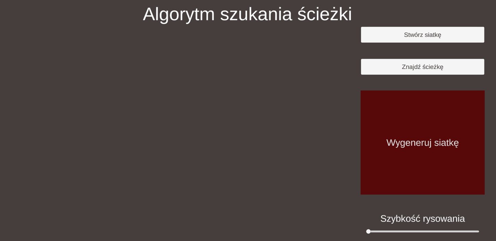

# A\* Unity

Simple A\* algorithm in Unity done as a recruitment task

## Showcase

---

### Used technologies

[<picture align="left"><source media="(prefers-color-scheme: light)" srcset="https://api.iconify.design/bi:unity.svg?color=%23000000" /></picture>](https://unity.com "Unity")

